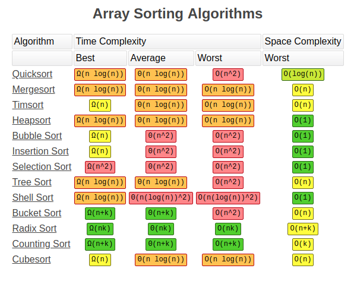

# Sorting Algorithm

## Sorting Terminology

### In-place sorting
An in-place sorting algorithm uses constant extra space for producing output
(modifies the given array only) ex. Insertion Sort and Selection Sorts

### Internal and External Sorting
For large amount of data, which can not store in memory at a time, this sorting is called `external sorting`. (Merge Sort and its variations are typically used for external sorting).  When all data is stored in memory, then sorting is called `internal sorting`

### stable sorting
A sorting algorithm is said to be stable if two objects with equal keys appear in the same order in sorted output.

## Time and space complexity

1. QuickSort
   `Dynamic Programming`
   - Minimun number of coins for sum
   - Number of ways to make the change
